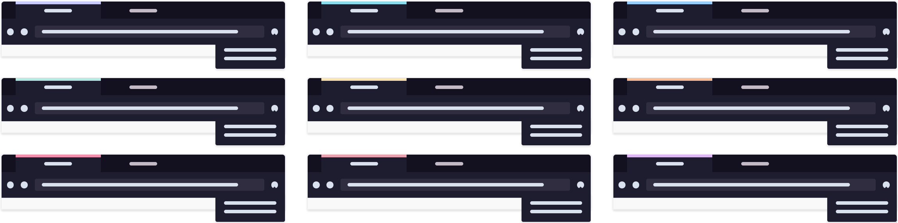

<h3 align="center">
	<br/>
	
	Catppuccin for Firefox
	
</h3>

<p align="center">
    <a href="https://github.com/catppuccin/firefox/stargazers"></a>
    <a href="https://github.com/catppuccin/firefox/issues"></a>
    <a href="https://github.com/catppuccin/firefox/contributors"></a>
</p>

<p align="center">
  
</p>

## Usage

1. Choose one of the themes from the list below:

    - [Rosewater](https://addons.mozilla.org/en-US/firefox/addon/catppuccin-dark-rosewater/)
    - [Flamingo](https://addons.mozilla.org/en-US/firefox/addon/catppuccin-dark-flamingo/)
    - [Mauve](https://addons.mozilla.org/en-US/firefox/addon/catppuccin-dark-mauve/)
    - [Pink](https://addons.mozilla.org/en-US/firefox/addon/catppuccin-dark-pink/)
    - [Maroon](https://addons.mozilla.org/en-US/firefox/addon/catppuccin-dark-maroon/)
    - [Red](https://addons.mozilla.org/en-US/firefox/addon/catppuccin-dark-red/)
    - [Peach](https://addons.mozilla.org/en-US/firefox/addon/catppuccin-dark-peach/)
    - [Yellow](https://addons.mozilla.org/en-US/firefox/addon/catppuccin-dark-yellow/)
    - [Green](https://addons.mozilla.org/en-US/firefox/addon/catppuccin-dark-green/)
    - [Teal](https://addons.mozilla.org/en-US/firefox/addon/catppuccin-dark-teal/)
    - [Blue](https://addons.mozilla.org/en-US/firefox/addon/catppuccin-dark-blue/)
    - [Sky](https://addons.mozilla.org/en-US/firefox/addon/catppuccin-dark-sky/)
    - [Lavender](https://addons.mozilla.org/en-US/firefox/addon/catppuccin-dark-lavender/)

<p align="center">
  
</p>

2. Click on `Install Theme`

## Development

##### Packaging:

```bash
make package # dest=/some/dir
```

## 💝 Thanks to

-   [Celeste](https://github.com/CelestialN3ko)

&nbsp;

<p align="center"></p>
<p align="center">Copyright &copy; 2020-present <a href="https://github.com/catppuccin" target="_blank">Catppuccin Org</a>
<p align="center"><a href="https://github.com/catppuccin/catppuccin/blob/main/LICENSE"></a></p>
